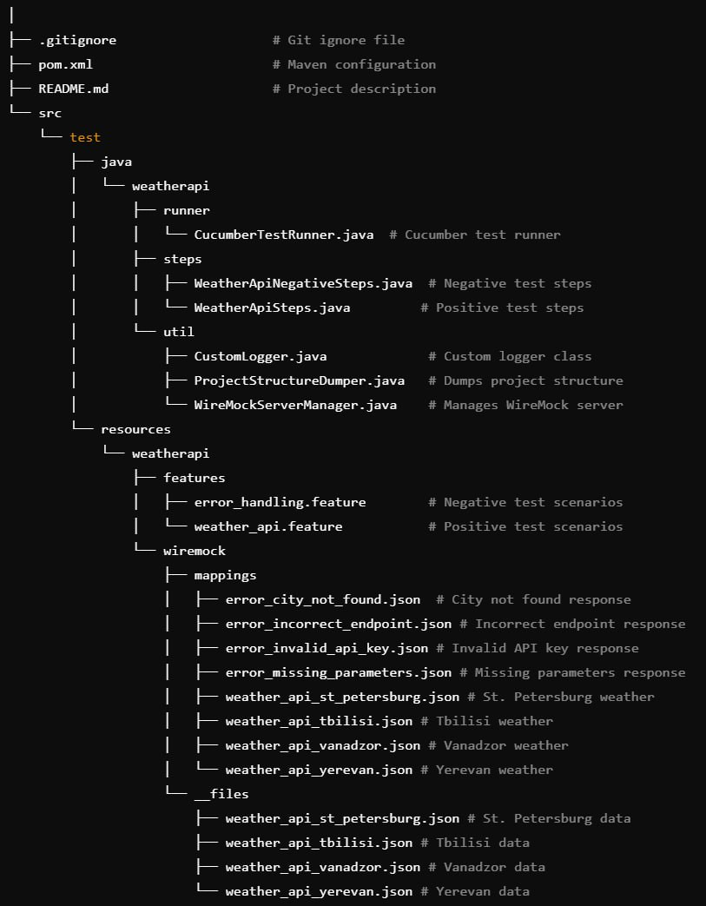

# WeatherAPI-Mock-BDD

It is a Java-based test project for testing a Weather API using WireMock and Cucumber (BDD). 
This project emulates API responses through mock servers instead of sending real HTTP requests to the weather service.
The tests validate both positive and negative scenarios and generate detailed test reports using Allure.

## How to run tests

Tests are executed using the `CucumberTestRunner` class.

## Features

- Mocking API responses with WireMock
- Behavior-driven testing with Cucumber
- Positive test cases for verifying weather data in multiple cities
- Negative test cases to handle different types of API errors
- Test results reported in Allure

## Tools & Technologies

- Java 11
- Maven (build automation)
- WireMock (mocking HTTP interactions)
- Cucumber (BDD framework)
- Allure (test reporting)

## Project structure 

### WeatherAPI-Mock-BDD

